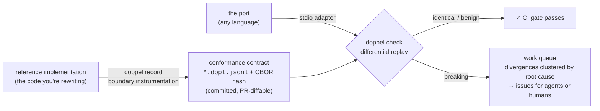

<div align="center">

<picture>
  <source media="(prefers-color-scheme: dark)" srcset="docs/assets/logo-dark.svg">
  
</picture>

**Record what your code does. Freeze it as a language-neutral contract. Diff any rewrite against it.**

[](https://github.com/VaishGajaraj/doppel/actions/workflows/ci.yml)
[](LICENSE)
[](package.json)
[](#roadmap)

</div>

---

**doppel** is a self-serve port-verification kit. It records a library's
behavior at its module boundary, freezes that behavior as a
language-independent **conformance contract**, and then differentially
replays the contract against any reimplementation — another language, another
framework, an agent-written rewrite — classifying every divergence as
*identical*, *benign*, or *breaking*, and turning the breaking ones into a
clustered work queue.

```console
$ npm run demo

  interactions  24
  identical     12
  benign        2
  breaking      10

  ✗ #10 statlib#percentile
      return: recorded 5.5 → port 5
  ✗ #20 statlib#summarize
      return.p95: recorded 9.549999999999999 → port 10
      return.stddev: recorded 3.0276503540974917 → port 2.8722813232690143
```

Those breaking divergences are two real injected regressions — a
nearest-rank percentile and a population-vs-sample stddev — that the port's
own test suite would happily bless, because the port's tests were written
from the port. They are only visible against a record of what the *original*
did. That asymmetry is the entire product.

## Why this exists

In July 2026, Bun's team [rewrote Bun from Zig to Rust](https://bun.com/blog/bun-in-rust)
using coding agents. The rewrite worked — and its aftermath made the case for
this tool better than any pitch deck could:

- The port shipped with **19 known regressions**, went through **11 rounds of
  security review**, and landed roughly **27K lines of `unsafe`**. Zig's
  creator called it ["unreviewed slop"](https://www.theregister.com/devops/2026/07/14/zig-creator-calls-buns-claude-rust-rewrite-unreviewed-slop/5270743).
- What made the rewrite *possible at all* was an accident of history: Bun's
  test suite ran against the CLI surface, making it a **language-independent
  behavioral oracle**. The agents weren't porting code; they were satisfying
  a behavioral spec that happened to exist. ([Simon Willison's analysis](https://simonwillison.net/2026/Jul/8/rewriting-bun-in-rust/))
- Meanwhile the "rewrite the legacy estate with agents" wave is macro-scale:
  Anthropic's COBOL-modernization positioning [knocked ~13% off IBM's market cap](https://futurumgroup.com/insights/ibm-vs-anthropic-a-tale-of-the-cobol-modernization-tape/)
  in a week.

Almost no codebase has Bun's accident. **Nothing production-grade will
give an arbitrary codebase that oracle.** Teams that want agent-driven
rewrites stall on one question — *how do we know it still works?* — and the
current answers are a consulting engagement or a prayer.

doppel manufactures the oracle: **boundary recording → language-independent
conformance contract → differential diffing → agent work queue.**

## The gap

| | boundary recording | behavioral equivalence | language-agnostic | self-serve |
|---|:---:|:---:|:---:|:---:|
| [Mechanical Orchard Imogen](https://www.mechanical-orchard.com/insights/mechanical-orchard-releases-imogen-platform-improvements) | ✅ | ✅ | mainframe-only | ❌ sales-led |
| [AWS Transform](https://aws.amazon.com/transform/mainframe/) | partial | validation scripts | mainframe-only | ❌ |
| [Fiberplane Drift](https://github.com/fiberplane/drift) | ❌ | spec-drift linting | ❌ | ✅ |
| Playbooks & DIY harnesses ([NxCode](https://www.nxcode.io/resources/news/bun-rust-ai-migration-verification-playbook-2026)) | ❌ | ❌ | — | — |
| Academic (Mokav, HEC, MatchFixAgent) | — | ✅ | ✅ | ❌ unproductized |
| **doppel** | ✅ | ✅ | ✅ | ✅ |

The enterprise players prove the mechanism works and charge mainframe prices
for it. The open tooling checks specs, not behavior. The positioning is
**"Imogen for everyone else"** — self-serve, language-agnostic, repo-scale —
and the window is open until an agent orchestrator bolts verification on.
(Full research notes: [July 2026 reevaluation](#appendix-venture-analysis).)

## How it works



1. **Record.** Run your test suite or a workload driver with the recorder
   attached (`doppel record`, or the `instrument()` API). Every crossing of
   the module boundary is captured — args at call time, return value or
   thrown error, sync/async timing, causality, with declared redaction rules
   quarantining non-determinism at the source.
2. **Contract.** Interactions serialize as canonical JSONL you check into
   the repo, hashed over a deterministic-CBOR encoding so the same behavior
   yields the same hash in every language. Re-recording an unchanged library
   is byte-identical. See the [contract spec](docs/contract-spec.md).
3. **Check.** `doppel check` spawns the port's adapter (a ~50-line program in
   the target language speaking NDJSON over stdio) and replays every recorded
   interaction. Divergences are classified `identical` / `benign` /
   `breaking` — benign only by explicit, reviewable rule (`--benign
   error.message`), never by default.
4. **Work queue.** `doppel issues` clusters breaking divergences by probable
   root cause and emits self-contained issue files — each with the exact
   recorded interaction as a minimal repro — ready for an agent (or a human)
   to burn down. `doppel check` exits non-zero for CI, and contracts are
   never auto-updated in CI: a changed boundary must be re-recorded and
   re-approved in a PR.

## Quickstart

```console
$ git clone https://github.com/VaishGajaraj/doppel && cd doppel
$ npm install
$ npm run demo        # record the example library, catch the injected regressions
$ npm test            # 48 tests: format vectors, recorder, differ, e2e
```

Record your own library's boundary from a driver or test suite:

```ts
import { RecordSession, instrument, writeContract } from 'doppel';
import * as mylib from 'mylib';

const session = new RecordSession({ library: 'mylib' });
session.start();
const lib = instrument(mylib, { module: 'mylib' });

// ...drive `lib` through real workloads: your test suite, captured
// production shapes, generated corpora...

writeContract('contracts/mylib.dopl.jsonl', session.finalize());
```

Or attach to an existing test run without touching code:

```console
$ DOPPEL_CONFIG=doppel.config.json \
    node --import doppel/register run-tests.js
```

Then wire the port to a stdio adapter and check it:

```console
$ doppel check \
    --contract contracts/mylib.dopl.jsonl \
    --adapter  "./target/debug/mylib-adapter" \
    --benign   error.message \
    --report-dir .doppel
$ doppel issues --report .doppel/report.json
```

Adapters exist for JavaScript/TypeScript (`doppel/adapter`, bundled) and
[Rust](adapters/rust) (reference crate). The protocol is
[a page of NDJSON](docs/contract-spec.md#adapter-wire-protocol-v0) — a Python
or Go adapter is an afternoon.

## Cross-language by construction

CI verifies the same committed contract two ways:

- against the **buggy JS port** — doppel must flag 10 breaking divergences
  (the injected regressions), or CI fails;
- against a **correct Rust port** ([`adapters/rust/examples/statlib.rs`](adapters/rust/examples/statlib.rs))
  that mirrors the reference's floating-point operation order — doppel must
  report all 24 interactions identical, bit-for-bit, across languages.

One contract, two implementations, both classifications machine-checked on
every push.

The very first CI run of the Rust check caught a real bug — not in the port,
but in the toolchain: serde_json's default float parsing is not correctly
rounded, and doppel flagged a recorded value coming back as its 1-ULP
neighbor (`0.9946342753246427` → `0.9946342753246428`, one bit apart).
Enabling serde_json's `float_roundtrip` feature fixed it. That is precisely
the class of silent drift this tool exists to catch, caught by its own gate.

## Architecture

Every non-obvious choice has an ADR with the rationale and the rejected
alternatives — [docs/adr](docs/adr):

| decision | choice |
|---|---|
| [Recorder](docs/adr/adr-001-recorder.md) | import-in-the-middle + require-in-the-middle (the OTel stack), Proxy innermost wrap |
| [Ordering & causality](docs/adr/adr-002-ordering-causality.md) | diagnostics_channel events + AsyncLocalStorage — zero cost when not recording |
| [Canonical format](docs/adr/adr-003-canonical-format.md) | deterministic CBOR (RFC 8949 §4.2.1) authoritative hash + JCS (RFC 8785) text mirror |
| [Value capture](docs/adr/adr-004-value-capture.md) | canonical value graphs: shared identity, cycles, Map/Set, BigInt, −0 all survive |
| [Non-determinism](docs/adr/adr-005-nondeterminism.md) | declared redaction rules in the contract header, applied by both sides |
| [Target harness](docs/adr/adr-006-rust-harness.md) | subprocess over stdio — a new language is a new binary, not a binding layer |
| [Storage & CI gate](docs/adr/adr-007-storage-ci-gate.md) | contracts in-repo, insta-style human approval, never auto-updated in CI |
| [Input generation](docs/adr/adr-008-input-generation.md) | fast-check drives the reference to widen recorded coverage (planned) |

Where v0 consciously deviates from an ADR, it's written down:
[implementation notes](docs/adr/implementation-notes.md).

## What would make us kill this

This project ships with its falsifiers attached. The venture thesis behind
doppel defines three hypothesis tests, and the numbers get published either
way:

1. **The oracle works.** Boundary recording must catch **≥ 8/10 injected
   regressions** that the target-language test suite misses, on a real
   5–20K-LOC library. *Kill if it can't after honest effort.* (The statlib
   demo is the miniature; the M4 dogfood port is the real test.)
2. **Teams want it.** Five discovery interviews with teams whose rewrites are
   stalled on verification. *Kill if not one would run it this quarter.*
3. **It stays agent-buildable.** Token spend logged per milestone against a
   $3–10K budget — the build itself is an experiment in agent-driven
   development with a verification gate.

## Roadmap

12-week track, from the [venture build plan](#appendix-venture-analysis):

| M | week | deliverable | exit criterion |
|---|---|---|---|
| M1 | 2 | Contract format spec + license decision | covers calls/returns/errors/ordering/async + non-determinism normalization; reviewed by 2 external devs |
| M2 | 5 | Recorder for Node/TypeScript | records a real 5–20K LOC OSS library; < 1 day integration; acceptable overhead |
| M3 | 8 | Differ + divergence report | every divergence links to the exact recorded interaction; documented benign-vs-breaking rules |
| M4 | 10 | Dogfood port + regression injection | ≥ 8/10 injected regressions caught that the target suite misses; token spend logged |
| M5 | 12 | Case study + demand evidence | Bun-postmortem-style writeup; 5 stalled-rewrite interviews; ≥ 1 team committed to a run |

v0.1 (this repo) is M1 plus working slices of M2/M3: the format is specified
and vector-tested, the recorder handles sync/async/throws/causality on real
module boundaries, and the differ + work queue run end-to-end against two
ports. Honest gaps, in the open: [implementation notes](docs/adr/implementation-notes.md).

## Open source, and the business behind it

The core is **AGPL-3.0** — the strongest copyleft that keeps a hosted wrapper
from strip-mining the project (that was the week-2 AGPL-vs-BSL decision; BSL
would have made "open source" a marketing word). The intended commercial wing
is boring and honest: **hosted verification runs, support, and migration
services**. Regulated industries (medical, automotive, finance) pay extra
because a conformance contract doubles as an **audit artifact** — evidence of
behavioral equivalence you can hand an assessor, which is precisely the
evidence a safety-critical rewrite needs anyway.

If you just want to verify your own port: clone it, it's yours, that's the
point.

## Appendix: venture analysis

<details>
<summary><b>The thesis, the market moment, and the window (July 2026 research)</b></summary>

### Thesis

The Bun rewrite worked because its test suite happened to be a
language-independent oracle. Nothing production-grade gives an arbitrary
codebase that oracle. Doppel: boundary recording → language-independent
conformance contract → differential diffing → agent work queue. "Imogen for
everyone else" — self-serve, language-agnostic, repo-scale.

### Demand signals

- Bun's agent-driven Zig→Rust port shipped with 19 known regressions, 11
  security-review rounds, ~27K lines of `unsafe`; the resulting "who
  verifies the rewrite?" debate is the loudest dev-tools conversation of the
  summer ([The Register](https://www.theregister.com/devops/2026/07/14/zig-creator-calls-buns-claude-rust-rewrite-unreviewed-slop/5270743),
  [Bun blog](https://bun.com/blog/bun-in-rust),
  [Simon Willison](https://simonwillison.net/2026/Jul/8/rewriting-bun-in-rust/)).
- Anthropic's COBOL-modernization positioning knocked ~13% off IBM
  ([Futurum](https://futurumgroup.com/insights/ibm-vs-anthropic-a-tale-of-the-cobol-modernization-tape/)) —
  the rewrite wave has macro cover.
- The [2026 State of Open Source report](https://opensource.org/blog/the-2026-state-of-open-source-report)
  documents the broader agent-written-code trust gap.

### Competitive landscape

- **No standalone self-serve product**: what exists is playbook content
  ([NxCode](https://www.nxcode.io/resources/news/bun-rust-ai-migration-verification-playbook-2026)),
  DIY harnesses, and spec-drift linting
  ([Fiberplane Drift](https://github.com/fiberplane/drift)) — none of it
  behavioral equivalence.
- **Enterprise convergence from above**:
  [Mechanical Orchard's Imogen](https://www.mechanical-orchard.com/insights/mechanical-orchard-releases-imogen-platform-improvements)
  does boundary recording + continuous verification — mainframe-only,
  sales-led. [AWS Transform](https://aws.amazon.com/transform/mainframe/)
  generates equivalence-validation scripts for mainframe estates. The
  mechanism is validated; the self-serve slot is empty.
- **Academic**: Mokav, HEC, MatchFixAgent show equivalence detection works;
  none productized.

### Verdict (July 2026)

Gap still open at the self-serve level; demand stronger post-Bun-fallout;
window closing from the enterprise side. Ship fast, in the open, before an
agent orchestrator bolts verification on as a feature.

### Civilian-use evaluation

Pure civilian developer tooling. Safety-critical rewrite verification
(medical, automotive) is a selling point: regulated industries pay for
verification evidence.

</details>

## Contributing

Early and moving fast — issues and PRs welcome. The invariants that won't
bend: determinism (same behavior ⇒ same bytes ⇒ same hash), language
neutrality (nothing JS-specific in the contract), and no silent benign
classifications. Run `npm test` and `npm run demo` before sending a PR;
contract files are never regenerated in CI, so include re-recorded contracts
in the PR when a boundary intentionally changes.

## License

[AGPL-3.0-only](LICENSE). The name is from *doppelgänger* — the port is the
double; doppel checks whether it's really you.
